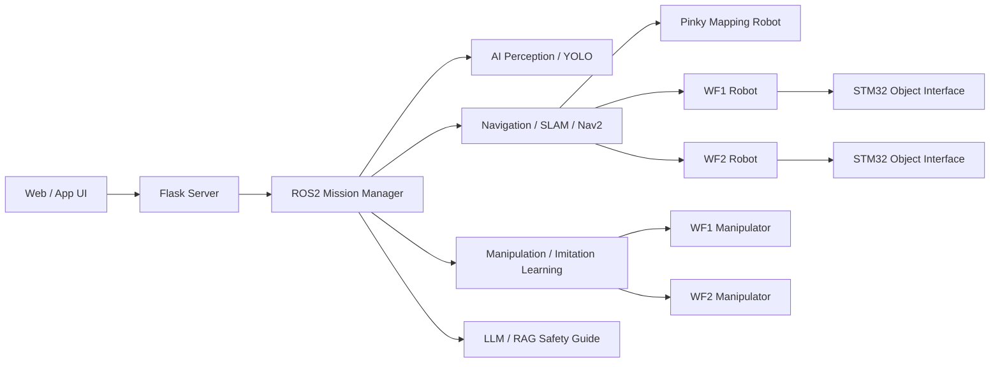
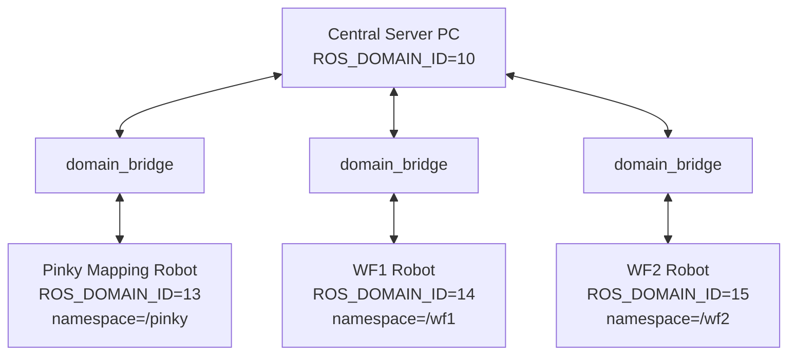
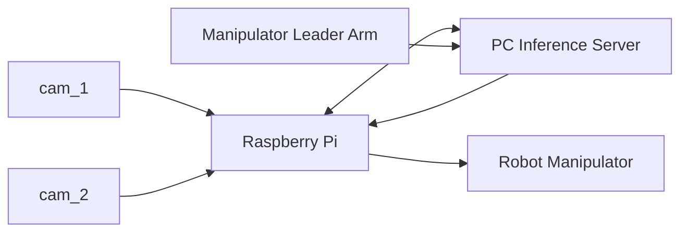
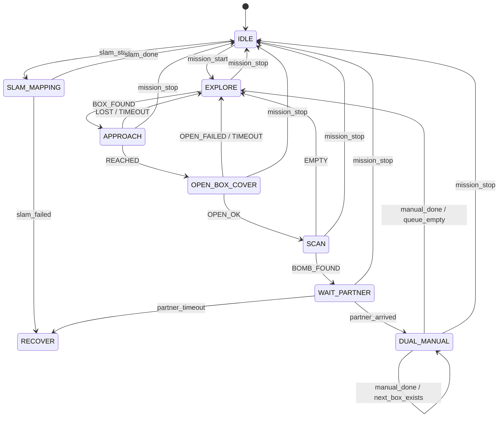

# ROScue

> **ROS 2 기반 지능형 협업 위험 객체 대응 로봇 시스템**  
> SLAM mapping, autonomous navigation, YOLO perception, imitation-learning manipulation, and dual-robot manual response.

<!-- TODO: demo gif or cover image -->
<!--  -->

---

## 1. Project Overview

**ROScue**는 ROS 2 기반 다중 로봇 협업 시스템입니다.  
Pinky Mapping Robot이 SLAM 기반 지도를 생성하고, WF1/WF2 주행·해체 로봇이 같은 지도를 기반으로 자율 탐색, 박스 식별, 박스 개방, 내부 객체 탐지, 협동 수동 대응을 수행합니다.

중앙 서버 PC는 전체 미션 상태를 관리하며, Web/App UI, ROS 2 Mission Manager, YOLO perception, Nav2 navigation, imitation learning inference, LLM/RAG 안내 시스템을 통합합니다.

### Key Objectives

- SLAM 기반 실내 지도 생성
- 작성된 지도 기반 WF1/WF2 자율 주행
- 좌표 DB 기반 목표 좌표 발행 및 가까운 로봇 배정
- YOLO 기반 박스 및 내부 객체 탐지
- 모방학습 기반 박스 개방 동작 수행
- 두 로봇 기반 협동 대응 및 원격 수동 조작
- LLM/RAG 기반 등록 객체 절차 안내
- STM32 기반 등록 객체 인터페이스 연동

> ⚠️ **Safety Notice**  
> 본 프로젝트는 교육 및 연구 목적의 로봇 시스템입니다.  
> 실제 위험물 제작, 해체, 무력화 절차를 제공하지 않으며, 실제 위험 상황에서는 반드시 전문 인력과 안전 규정을 따라야 합니다.

---

## 2. Demo Scenario

ROScue 데모는 다음 5단계로 구성됩니다.

| Step | Scenario | Description |
|---:|---|---|
| 1 | 사전 준비 및 자율 탐색 | SLAM 매핑, 지도 로딩, 두 로봇 자율 탐색 시작 |
| 2 | 박스 탐색 및 발견 | YOLO 기반 박스 식별, close/open 상자 감지 시 접근 |
| 3 | 박스 개방 및 내부 스캔 | 모방학습 기반 박스 개방, 내부 객체 탐지, 빈 박스 복귀 |
| 4 | 로봇 호출 및 협업 | 위험 객체 감지 시 파트너 로봇 호출, 두 로봇 수동 조작 모드 전환 |
| 5 | 원격 대응 및 복귀 | 운영자가 수동 조작 완료 후 자율 탐색 재시작 또는 미션 종료 |

---

## 3. System Architecture

### 3.1 Logical Architecture



### 3.2 Hardware Architecture

ROScue의 하드웨어는 관제 PC, Raspberry Pi 4, OpenCR, Dynamixel, LiDAR, 카메라, 매니퓰레이터, STM32 기반 등록 객체 인터페이스로 구성됩니다.

| Component | Role |
|---|---|
| High-Performance PC | 관제, AI 서버, LLM/RAG, 모방학습 추론 서버 |
| Raspberry Pi 4 | 상위 제어기, ROS 2 통신, 카메라/LiDAR 데이터 처리 |
| OpenCR | 하위 제어기, Dynamixel 및 주행 하드웨어 제어 |
| Camera | 상황 관찰, YOLO 입력 영상 스트림 |
| LiDAR | 공간 정보, SLAM 및 Nav2 입력 |
| Manipulator | 박스 개방, 수동 조작, 리더-팔로워 제어 |
| Dynamixel | 주행 구동 및 엔코더 상태 피드백 |
| STM32 | 등록 객체 인터페이스, 버튼/LCD/LED/Buzzer/센서 제어 |

---

## 4. Robot Roles

### 4.1 Pinky Mapping Robot

Pinky Mapping Robot은 실내 공간의 SLAM 지도를 생성하고, 지도 및 좌표 정보를 중앙 서버로 전달합니다.

주요 역할:

- SLAM 기반 지도 생성
- `/map`, `/map_metadata` 전달
- RViz2 clicked point 또는 랜덤 좌표 발행
- 좌표 DB 저장을 위한 point 데이터 제공

### 4.2 WF1 / WF2 Robots

WF1과 WF2는 실제 자율 주행, 박스 탐지, 박스 개방, 내부 스캔, 협동 대응을 담당합니다.

주요 역할:

- Nav2 기반 목표 좌표 이동
- YOLO 기반 박스 탐지
- 박스 접근 및 내부 검사
- 매니퓰레이터 기반 박스 개방
- 위험 객체 감지 시 협동 수동 모드 진입

### 4.3 Central Server PC

중앙 서버 PC는 Mission Manager, 좌표 DB, domain bridge, Web UI, AI 서버를 통합합니다.

주요 역할:

- 전체 미션 상태 관리
- 로봇별 현재 위치 수신
- 좌표 DB 저장
- 가까운 로봇에게 목표 좌표 배정
- WF1/WF2 goal pose 전송
- 주행 취소 및 미션 정지 처리
- YOLO 이벤트 수신
- LLM/RAG 안내 생성

---

## 5. Domain and Namespace Architecture

ROScue는 로봇별 독립 ROS_DOMAIN_ID와 namespace를 사용합니다.

| System | ROS_DOMAIN_ID | Namespace | Role |
|---|---:|---|---|
| Central Server PC | 10 | `/server` | Mission Manager, DB, bridge, Web UI |
| Pinky Mapping Robot | 13 | `/pinky` | SLAM mapping |
| WF1 Robot | 14 | `/wf1` | Navigation and manipulation |
| WF2 Robot | 15 | `/wf2` | Navigation and manipulation |

### Final Communication Structure



### Bridge Policy

- 모든 로봇은 독립 domain에서 기본 topic을 사용합니다.
- 중앙 서버 PC에서 domain별 bridge를 운영합니다.
- WF1/WF2의 map server는 제거하고, Pinky가 만든 `/map`을 bridge로 전달합니다.
- 중앙 서버 PC에서 robot별 topic을 구분합니다.
- 로봇 내부 remap 문제를 줄이고, 서버-로봇 간 bridge 구간에서만 topic을 분리합니다.

---

## 6. Mission Flow

### Phase 0 — SLAM Mapping

```text
운영자 SLAM 시작
→ Pinky Mapping Robot 수동 주행
→ SLAM 지도 생성
→ /map, /map_metadata 중앙 서버 전달
→ 좌표 DB 저장
→ WF1/WF2 자율 주행 준비
```

State transition:

```text
IDLE → SLAM_MAPPING → IDLE
```

---

### Phase 1 — Autonomous Exploration & Box Detection

```text
운영자 미션 시작
→ WF1/WF2 자율 탐색
→ YOLO 기반 close/open 박스 탐지
→ 박스 좌표 등록
→ 목표 지점 접근
```

State transition:

```text
IDLE → EXPLORE → APPROACH
```

---

### Phase 2 — Box Opening & Internal Scan

```text
목표 박스 접근 완료
→ 매니퓰레이터 위치 정렬
→ 모방학습 기반 박스 개방
→ 내부 카메라 스캔
→ YOLO 기반 Empty / Bomb_A / Bomb_B 판단
```

State transition:

```text
APPROACH → OPEN_BOX_COVER → SCAN
```

---

### Phase 3 — Dual-Robot Cooperative Response

```text
Bomb_A/B 감지
→ 발견 로봇 WAIT_PARTNER
→ 파트너 로봇 호출
→ 두 로봇 DUAL_MANUAL 진입
→ 운영자가 원격 수동 조작
→ 완료 후 탐색 재개 또는 임무 종료
```

State transition:

```text
SCAN → WAIT_PARTNER → DUAL_MANUAL → EXPLORE
```

---

## 7. Navigation and Coordinate Dispatch

Pinky가 작성한 지도와 좌표 정보는 중앙 서버를 통해 WF1/WF2에 전달됩니다.

### Coordinate Dispatch Flow

```text
1. Pinky 수동 주행
2. SLAM 지도 작성
3. RViz2 clicked_point 또는 랜덤 좌표 발행
4. 중앙 서버가 좌표 DB에 저장
5. WF1/WF2 현재 위치 수신
6. 좌표와 각 로봇 사이 거리 계산
7. 가까운 로봇에게 goal pose 전달
```

### Main Topics

| Topic | Direction | Description |
|---|---|---|
| `/map` | Pinky → Server → WF1/WF2 | SLAM map |
| `/map_metadata` | Pinky → Server → WF1/WF2 | Map metadata |
| `/clicked_point` | Pinky/RViz2 → Server | 수동 지정 좌표 |
| `/wf1/goal_pose` | Server → WF1 | WF1 목표 좌표 |
| `/wf2/goal_pose` | Server → WF2 | WF2 목표 좌표 |
| `/wf1/amcl_pose` | WF1 → Server | WF1 현재 위치 |
| `/wf2/amcl_pose` | WF2 → Server | WF2 현재 위치 |
| `/driving_command` | Server → Pinky | SLAM start/stop command |
| `/cancel_navigation` | Server → WF1/WF2 | 주행 취소 |

---

## 8. Perception

ROScue는 YOLO 기반으로 박스와 내부 등록 객체를 탐지합니다.

### Detection Modes

| Mode | Target |
|---|---|
| `BOX_DETECTION_MODEL` | close box, open box |
| `EXPLOSIVE_DETECTION_MODEL` | Empty, Bomb_A, Bomb_B |

### YOLO Model Benchmark

| Model | mAP50-95 | Recall | Precision |
|---|---:|---:|---:|
| YOLO10m | 93.90% | 99.66% | 99.64% |
| YOLO11m | 94.11% | 99.71% | 99.89% |
| YOLO26m | 95.21% | 99.71% | 99.91% |

> TODO: Dataset size, training condition, validation split, and inference device details.

---

## 9. Manipulation and Imitation Learning

박스 개방 동작은 매니퓰레이터와 모방학습 기반 policy를 사용합니다.

### Box Open Motion Sequence

```text
접근 위치 조정
→ 손잡이 인식
→ 엔드이펙터 정렬
→ 전진 및 파지
→ 상승 동작
→ 지정 위치 이동
→ 파지 해제 및 복귀
```

### Imitation Learning System



### Robustness Strategy

| Method | Description |
|---|---|
| Domain Randomization | 조명, 배경, 객체 색상, 질감, 센서 노이즈를 변화시키며 데이터 수집 |
| State Perturbation | 불안정한 초기 상태에서 복구하는 데이터 수집 |
| DAgger | 사용자 개입 데이터를 누적하여 어려운 상태 대응 성능 개선 |

---

## 10. LLM / RAG Response System

ROScue는 YOLO 탐지 결과를 바탕으로 LLM/RAG 기반 안내를 생성합니다.

### Response Flow

```text
카메라 영상 수신
→ YOLO 탐지
→ confidence 기준 확인
→ 일정 시간 유지 조건 확인
→ Web Server 탐지 결과 수신
→ RAG 문서 검색
→ LLM 안내문 생성
→ Web UI 출력
```

### Registered and Unregistered Objects

| Type | Example | Handling |
|---|---|---|
| Registered Object | Bomb_A, Bomb_B | 등록된 절차 문서 기반 안내 |
| Empty | Empty | 등록 객체 없음 안내 |
| Unregistered Object | Bomb_C | 정보 없음, 조작 중지, 관리자 확인 요청 |

> LLM은 실제 로봇 제어권을 갖지 않습니다.  
> 상태 전이, 정지, 파트너 호출, 수동 모드 전환은 Mission Manager가 수행합니다.

---

## 11. STM32 Object Interface

프로젝트 등록 객체는 STM32 기반 인터페이스를 포함합니다.

### Interface Components

| Component | Role |
|---|---|
| Button A/B/C/D | 입력 버튼 |
| LCD | 카운트다운 및 상태 표시 |
| LED | 단계별 상태 표시 |
| Buzzer | 경고음 출력 |
| Light Sensor | 특정 조건 감지 |
| Joystick | 상하좌우 조작 |
| STM32 | 메인 제어기 |

### LED Status Example

| Color | Meaning |
|---|---|
| RED | 카운트다운 시작 또는 실패 |
| YELLOW | 진행 중 또는 성공 |
| GREEN | 단계별 성공 |

---

## 12. Mission State Machine



---

## 13. Tech Stack

| Layer | Category | Technology | Role |
|---|---|---|---|
| Front-End | Web | HTML, CSS, JavaScript | 미션 시작, 수동 조작 인터페이스 |
| Back-End | Flask Server | Python, Flask, OpenCV | 카메라 스트리밍, API 서버 |
| Middleware | ROS2 Mission Manager | ROS 2, Python, State Machine | 상태 관리, 이벤트 핸들링 |
| AI / ML | AI Perception | YOLO26m, PyTorch, OpenCV | 박스 탐지, 등록 객체 탐지 |
| Navigation | Navigation | SLAM, Nav2, ROS 2 | 지도 작성, 경로 계획, 다중 로봇 제어 |
| Manipulation | Robot Manipulation | OMX Arm, Imitation Learning, Leader-Follower | 박스 개방, 원격 조작 |
| Embedded | Object Interface | STM32, LCD, LED, Button, Buzzer | 등록 객체 인터페이스 |

---

## 14. Troubleshooting Highlights

| Issue | Cause | Solution |
|---|---|---|
| namespace / domain 충돌 | 여러 로봇이 동일 topic/frame 사용 | ROS_DOMAIN_ID 분리, namespace 적용 |
| map 중복 발행 | WF1/WF2 map server와 Pinky map 충돌 | WF1/WF2 map server 제거, Pinky map bridge 사용 |
| ROS2-LeRobot Python 버전 충돌 | ROS2는 Python 3.10, LeRobot은 Python 3.12 환경 사용 | 필요한 모듈 분리 및 패키지 내부 복사 |
| 모방학습 카메라 환경 차이 | 카메라 밝기, 각도, 배경 차이 | 실제 조건에서 추가 데이터 수집 |
| 추론 통신 지연 | 네트워크 latency | 독립망 구성, 지연 허용 범위 조정 |
| YOLO low confidence | 조명, 시점, 데이터 부족 | 재촬영, threshold 조정, 안정 프레임 조건 적용 |

---

## 15. Quick Start

> TODO: 실제 패키지명과 launch 파일 확정 후 업데이트

### Clone

```bash
git clone https://github.com/<ORG_OR_USER>/ROScue.git
cd ROScue
```

### Build ROS 2 Workspace

```bash
cd ros2_ws
colcon build
source install/setup.bash
```

### Start Central Server

```bash
ros2 launch roscue_bringup central_server.launch.py
```

### Start Pinky Mapping Robot

```bash
export ROS_DOMAIN_ID=13
ros2 launch roscue_bringup pinky_mapping.launch.py
```

### Start WF1 / WF2

```bash
export ROS_DOMAIN_ID=14
ros2 launch roscue_bringup robot.launch.py robot_ns:=wf1
```

```bash
export ROS_DOMAIN_ID=15
ros2 launch roscue_bringup robot.launch.py robot_ns:=wf2
```

### Start Web UI

```bash
cd web
python3 web_server.py
```

---

## 16. Documentation

| Document | Description |
|---|---|
| [`docs/scenario.md`](docs/scenario.md) | 전체 미션 시나리오 |
| [`docs/architecture/system_architecture.md`](docs/architecture/system_architecture.md) | 전체 시스템 아키텍처 |
| [`docs/architecture/hardware_architecture.md`](docs/architecture/hardware_architecture.md) | 하드웨어 시스템 구성 |
| [`docs/architecture/domain_namespace_bridge.md`](docs/architecture/domain_namespace_bridge.md) | ROS_DOMAIN_ID, namespace, domain_bridge 구조 |
| [`docs/navigation/pinky_mapping.md`](docs/navigation/pinky_mapping.md) | Pinky SLAM 지도 생성 |
| [`docs/navigation/coordinate_dispatch.md`](docs/navigation/coordinate_dispatch.md) | 좌표 DB 및 goal pose 발행 |
| [`docs/perception/yolo_detection.md`](docs/perception/yolo_detection.md) | YOLO 탐지 구조 |
| [`docs/perception/yolo_model_benchmark.md`](docs/perception/yolo_model_benchmark.md) | YOLO 모델별 성능 비교 |
| [`docs/manipulation/box_open_imitation_learning.md`](docs/manipulation/box_open_imitation_learning.md) | 모방학습 기반 박스 개방 |
| [`docs/llm_rag/rag_response_flow.md`](docs/llm_rag/rag_response_flow.md) | LLM/RAG 응답 구조 |
| [`docs/embedded/stm32_object_interface.md`](docs/embedded/stm32_object_interface.md) | STM32 등록 객체 인터페이스 |
| [`docs/troubleshooting/`](docs/troubleshooting/) | 주요 문제 해결 기록 |

---

## 17. Roadmap

- [ ] Pinky SLAM map bridge 안정화
- [ ] WF1/WF2 Nav2 goal dispatch 고도화
- [ ] 좌표 DB 및 가까운 로봇 배정 로직 구현
- [ ] YOLO26m 모델 최종 적용
- [ ] 박스 개방 모방학습 policy 안정화
- [ ] Leader-Follower 수동 조작 UI 연동
- [ ] LLM/RAG 등록 객체 안내 UI 연동
- [ ] STM32 등록 객체 인터페이스 통합
- [ ] 전체 데모 영상 제작
- [ ] 발표용 아키텍처 다이어그램 정리

---

## 18. Team

| Role | Member |
|---|---|
| Project Manager | TODO |
| ROS 2 / Navigation | TODO |
| YOLO / Perception | TODO |
| Manipulation / Imitation Learning | TODO |
| Web / Server | TODO |
| Embedded / STM32 | TODO |
| LLM / RAG | TODO |

---

## 19. License

TODO
