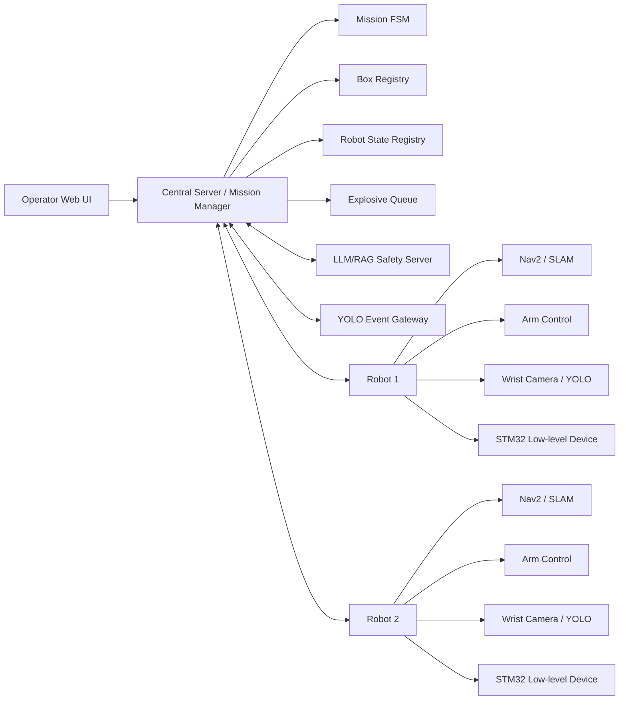
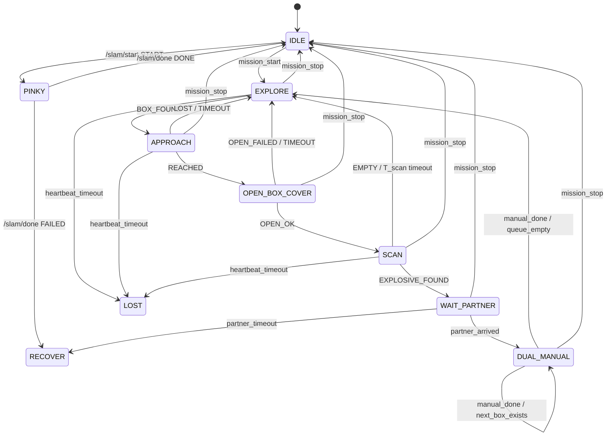

# ROScue

> **ROS 2 기반 지능형 협업 위험 객체 대응 로봇 시스템**  
> Autonomous exploration, object detection, box inspection, and dual-robot manual response system.

<!-- TODO: 발표 표지 이미지 또는 데모 GIF 추가 -->
<!--  -->

---

## 1. Overview

**ROScue**는 ROS 2 기반 다중 로봇 협업 시스템입니다.  
로봇은 SLAM으로 실내 지도를 생성하고, Nav2 기반 자율 탐색을 수행하며, YOLO 기반 객체 탐지를 통해 상자와 위험 객체 후보를 인식합니다. 위험 객체 후보가 확인되면 중앙 서버가 파트너 로봇을 호출하고, 운영자는 Web UI를 통해 두 로봇을 수동 조작하여 대응 절차를 수행합니다.

본 프로젝트의 핵심 목표는 다음과 같습니다.

- SLAM 기반 실내 지도 생성
- 지도 기반 자율 탐색
- YOLO 기반 상자 및 위험 객체 탐지
- 로봇팔 기반 상자 개방 및 내부 검사
- 중앙 서버 기반 다중 로봇 상태 관리
- 위험 객체 발견 시 파트너 로봇 소환
- Web UI 기반 dual manual operation
- LLM/RAG 기반 상황 설명 및 안전 안내

> ⚠️ **Safety Notice**  
> 이 프로젝트는 교육 및 연구 목적의 로봇 시스템입니다.  
> 실제 폭발물 제작, 해체, 무력화 절차를 제공하지 않으며, 실제 위험물 대응은 전문 인력과 안전 규정을 따라야 합니다.

---

## 2. Project Scenario

ROScue의 전체 미션은 4개 Phase로 구성됩니다.

### Phase 0 — SLAM 지도 생성

운영자가 Web UI에서 로봇을 선택하고 SLAM을 시작합니다.  
주행팀은 로봇을 수동 조작하여 공간 전체를 주행하고, SLAM 스택을 통해 지도를 생성합니다.

```text
IDLE
  └── /slam/start: START
        ↓
PINKY
  └── /slam/done: DONE
        ↓
IDLE
```

실패 시:

```text
PINKY
  └── /slam/done: FAILED
        ↓
RECOVER
```

> TODO: `PINKY`가 로봇 이름인지, SLAM 상태 이름인지 용어 확정 필요

---

### Phase 1 — Autonomous Exploration & Box Detection

운영자가 Web UI에서 미션을 시작하면 로봇은 `EXPLORE` 상태로 전환됩니다.  
Nav2 내비게이션을 기반으로 지도 공간을 탐색하며, 손목 카메라의 YOLO 모델은 `BOX_DETECTION_MODEL` 모드로 상자를 탐지합니다.

```text
IDLE
  └── mission_start
        ↓
EXPLORE
  └── BOX_FOUND
        ↓
APPROACH
```

상자가 감지되면 중앙 서버는 box registry에 신규 박스를 등록합니다.  
기존 박스와 0.5 m 이내라면 중복 박스로 처리합니다.

---

### Phase 2 — Box Opening & Internal Scan

로봇이 상자 0.4 m 앞까지 접근하면 Nav2를 정지하고, 로봇팔을 이용해 상자 뚜껑을 엽니다.  
뚜껑 개방 후 YOLO 모드를 `EXPLOSIVE_DETECTION_MODEL`로 전환하고 상자 내부를 검사합니다.

```text
APPROACH
  └── REACHED
        ↓
OPEN_BOX_COVER
  └── OPEN_OK
        ↓
SCAN
```

분기:

```text
SCAN
  ├── EMPTY or T_scan timeout
  │     ↓
  │   EXPLORE
  │
  └── EXPLOSIVE_FOUND
        ↓
      WAIT_PARTNER
```

---

### Phase 3 — Dual-Robot Cooperative Response

위험 객체 후보가 감지되면 발견 로봇은 `WAIT_PARTNER` 상태로 진입합니다.  
중앙 서버는 파트너 로봇의 현재 작업을 선점 취소하고, 파트너를 상자 옆 지정 위치로 이동시킵니다.

```text
WAIT_PARTNER
  └── partner_arrived
        ↓
DUAL_MANUAL
```

운영자는 Web UI에서 두 로봇 팔을 수동 조작합니다.  
처리 완료 후 운영자가 완료 버튼을 누르면 box 상태는 `RESOLVED`로 전환됩니다.

```text
DUAL_MANUAL
  └── manual_done
        ↓
EXPLORE
```

---

## 3. System Architecture



---

## 4. Core Features

### 4.1 SLAM Mapping

- SLAM 시작/종료 명령을 중앙 서버에서 관리
- 지도 생성 완료 시 로봇 상태를 `IDLE`로 복귀
- 실패 시 `RECOVER` 상태로 전환

### 4.2 Autonomous Exploration

- Nav2 기반 지도 탐색
- 탐색 중 YOLO 상자 탐지
- 발견 좌표 저장 및 중복 박스 필터링

### 4.3 Visual Servo Approach

- 상자 감지 후 Nav2 정지
- YOLO bbox 기반 비주얼 서보 접근
- 목표 거리: 상자 전방 약 0.4 m

### 4.4 Box Cover Opening

- 로봇팔 토크 해제
- 모방학습 또는 사전 정의된 액션으로 상자 뚜껑 개방
- 실패 또는 타임아웃 시 `OPEN_FAILED` 처리

### 4.5 Internal Object Scan

- YOLO 모드 전환: `EXPLOSIVE_DETECTION_MODEL`
- 검사 시간: `T_scan = 10s`
- 결과:
  - `EMPTY`
  - `EXPLOSIVE_FOUND`
  - `TIMEOUT`

### 4.6 Dual Manual Operation

- 파트너 로봇 호출
- 두 로봇을 90° 분리된 위치에 배치
- Web UI에서 두 로봇 팔 수동 조작
- 운영자 완료 입력 후 box 상태 `RESOLVED`

### 4.7 LLM/RAG Safety Guide

- YOLO 탐지 결과를 기반으로 안전 안내 생성
- 등록되지 않은 객체는 추측하지 않고 “정보 없음”으로 처리
- 실제 해체 절차 자동 생성 금지
- Web UI에 상황 설명 및 안내문 표시

---

## 5. Mission State Machine



---

## 6. Robot States

| State | Description |
|---|---|
| `IDLE` | 대기 상태 |
| `PINKY` | SLAM 지도 생성 상태 |
| `EXPLORE` | 자율 탐색 상태 |
| `APPROACH` | 상자 접근 상태 |
| `OPEN_BOX_COVER` | 상자 뚜껑 개방 상태 |
| `SCAN` | 상자 내부 검사 상태 |
| `WAIT_PARTNER` | 파트너 로봇 대기 상태 |
| `SUMMONED` | 파트너 로봇 소환 상태 |
| `DUAL_MANUAL` | 두 로봇 수동 조작 상태 |
| `RECOVER` | 복구 필요 상태 |
| `LOST` | heartbeat 단절 상태 |

---

## 7. Box States

| State | Description |
|---|---|
| `UNKNOWN` | 아직 검사 전 |
| `CLEAR` | 등록 위험 객체 없음 |
| `EXPLOSIVE_PENDING` | 위험 객체 후보 발견, 처리 대기 |
| `OPEN_FAILED` | 뚜껑 개방 실패 |
| `REVISIT` | 접근 실패 후 재방문 필요 |
| `RESOLVED` | 운영자 처리 완료 |

---

## 8. ROS 2 Interfaces

> TODO: 메시지 타입은 구현 확정 후 `roscue_interfaces` 기준으로 업데이트

### Topics

| Topic | Direction | Description |
|---|---|---|
| `/slam/start` | Server → Robot | SLAM 시작 명령 |
| `/slam/done` | Robot → Server | SLAM 완료/실패 알림 |
| `/yolo/event` | YOLO → Server | BOX_FOUND, EMPTY, EXPLOSIVE_FOUND 등 |
| `/mission/state` | Server → UI | 현재 미션 상태 |
| `/mission/emergency_stop` | UI → Server | 긴급 정지 |
| `/<robot_ns>/cmd_vel` | Nav2/Controller → Robot | 로봇 속도 명령 |
| `/<robot_ns>/odom` | Robot → ROS | odometry |
| `/<robot_ns>/scan` | Robot → ROS | LiDAR scan |
| `/<robot_ns>/heartbeat` | Robot → Server | 로봇 생존 신호 |

### Actions

| Action | Description |
|---|---|
| `/<robot_ns>/navigate_to_pose` | Nav2 목표 위치 이동 |
| `/<robot_ns>/follow_target` | YOLO 기반 비주얼 서보 접근 |
| `/<robot_ns>/open_box_cover` | 상자 뚜껑 개방 액션 |
| `/<robot_ns>/arm_manual_control` | 수동 조작 모드 |

### Example Namespace Convention

현재 README에서는 추상 표기를 사용합니다.

```text
<robot_ns> = wf1 | wf2
```

또는 TurtleBot3 예제 기준:

```text
<robot_ns> = tb3_1 | tb3_2
```

> TODO: 최종 레포지토리에서는 `wf1/wf2` 또는 `tb3_1/tb3_2` 중 하나로 통일

---

## 9. Tech Stack

| Area | Stack |
|---|---|
| Robot Middleware | ROS 2 Jazzy |
| Navigation | Nav2 |
| Mapping | slam_toolbox |
| Object Detection | YOLO |
| Web UI | Flask / HTML / JS |
| AI Assistant | Ollama / Gemma / RAG |
| Robot Arm | OpenMANIPULATOR-X or custom arm control |
| Low-level Device | STM32 |
| Build System | colcon / ament |
| Language | Python, C/C++ |

---

## 10. Repository Layout

```text
ROScue/
├── README.md
├── docs/
│   ├── scenario.md
│   ├── architecture.md
│   ├── ros_interfaces.md
│   ├── setup.md
│   ├── runbook.md
│   ├── troubleshooting.md
│   └── safety_policy.md
├── ros2_ws/
│   └── src/
│       ├── roscue_bringup/
│       ├── roscue_mission_manager/
│       ├── roscue_interfaces/
│       ├── roscue_navigation/
│       ├── roscue_yolo/
│       ├── roscue_arm_control/
│       └── roscue_web_bridge/
├── web/
├── ai/
├── stm32/
├── maps/
├── models/
├── scripts/
└── tests/
```

---

## 11. Quick Start

> TODO: 실제 패키지명 확정 후 업데이트

### 11.1 Clone

```bash
git clone https://github.com/<ORG_OR_USER>/ROScue.git
cd ROScue
```

### 11.2 Build ROS 2 Workspace

```bash
cd ros2_ws
colcon build
source install/setup.bash
```

### 11.3 Start Central Server

```bash
ros2 launch roscue_bringup central_server.launch.py
```

### 11.4 Start Robot

```bash
ros2 launch roscue_bringup robot.launch.py robot_ns:=wf1
ros2 launch roscue_bringup robot.launch.py robot_ns:=wf2
```

### 11.5 Start Web UI

```bash
cd web
python3 web_server.py
```

Browser:

```text
http://<SERVER_IP>:8000
```

---

## 12. Demo Flow

```text
1. Web UI에서 로봇 선택
2. SLAM 시작
3. 지도 생성 완료
4. 미션 시작
5. 로봇 자율 탐색
6. 상자 탐지
7. 상자 접근
8. 상자 뚜껑 개방
9. 내부 검사
10. 위험 객체 후보 발견
11. 파트너 로봇 호출
12. 두 로봇 수동 조작 모드 진입
13. 운영자 처리 완료
14. 탐색 재개
```

---

## 13. Exception Handling

| Situation | Handling |
|---|---|
| SLAM 실패 | `PINKY → RECOVER`, 운영자 재시도 |
| Visual servo LOST/TIMEOUT | 박스 `REVISIT` 등록 후 `EXPLORE` 복귀 |
| 뚜껑 열기 실패 | 박스 `OPEN_FAILED`, `EXPLORE` 복귀 |
| 뚜껑 열기 타임아웃 60s | 박스 `OPEN_FAILED`, `EXPLORE` 복귀 |
| 파트너 120s 내 미도착 | 발견 로봇 `RECOVER` |
| heartbeat 3s 단절 | 로봇 `LOST` 처리 |
| 수동 조작 10분 초과 | 일시정지 및 알림 |
| 미션 정지 명령 | 어떤 상태에서든 `IDLE` 복귀 |

---

## 14. Current Status

> TODO: 구현 상태 업데이트

| Module | Status | Note |
|---|---|---|
| SLAM | In Progress | 지도 생성 및 저장 |
| Nav2 Exploration | In Progress | 자율 탐색 |
| YOLO Box Detection | In Progress | BOX model |
| YOLO Internal Scan | In Progress | Empty / Bomb_A / Bomb_B |
| Mission Manager | Planned | FSM 구현 필요 |
| Web UI | In Progress | 상태 표시 및 버튼 |
| Dual Manual Control | Planned | 리더암 2개 연동 |
| LLM/RAG Safety Guide | Planned | 등록 문서 기반 안내 |
| STM32 Device | In Progress | 버튼/LCD/상태 표시 |

---

## 15. Troubleshooting

자세한 내용은 [`docs/troubleshooting.md`](docs/troubleshooting.md)를 참고합니다.

자주 발생하는 문제:

| Problem | Cause | Solution |
|---|---|---|
| 로봇이 움직이지 않음 | namespace 또는 `/cmd_vel` 타입 불일치 | topic info 확인 |
| 로봇 2대 TF 충돌 | frame id 중복 | 로봇별 frame prefix 적용 |
| Nav2 goal 실패 | 미탐색 영역 또는 costmap 문제 | 이미 탐색된 map 좌표로 테스트 |
| YOLO 오탐 | confidence 낮음, 조명 문제 | threshold 및 stable frame 적용 |
| LLM 응답 지연 | 로컬 모델 성능 한계 | 비동기 처리 및 중앙 PC 실행 |

---

## 16. Roadmap

- [ ] Mission Manager FSM 구현
- [ ] Box registry 및 중복 제거 구현
- [ ] `/yolo/event` 표준 메시지 정의
- [ ] `wf1/wf2` namespace 통일
- [ ] Dual robot Nav2 goal dispatch 구현
- [ ] Web UI에서 실시간 상태 표시
- [ ] LLM/RAG 안전 안내 연동
- [ ] STM32 상태 표시 장치 연동
- [ ] Gazebo/RViz 시뮬레이션 테스트
- [ ] 최종 데모 영상 제작

---

## 17. Documentation

| Document | Description |
|---|---|
| [`docs/scenario.md`](docs/scenario.md) | 전체 시나리오 상세 |
| [`docs/architecture.md`](docs/architecture.md) | 시스템 아키텍처 |
| [`docs/ros_interfaces.md`](docs/ros_interfaces.md) | ROS 2 topic/service/action 정의 |
| [`docs/setup.md`](docs/setup.md) | 설치 방법 |
| [`docs/runbook.md`](docs/runbook.md) | 실행 순서 |
| [`docs/troubleshooting.md`](docs/troubleshooting.md) | 문제 해결 |
| [`docs/safety_policy.md`](docs/safety_policy.md) | 안전 제한 및 LLM/RAG 정책 |

---

## 18. Team

| Role | Member |
|---|---|
| Project Manager | TODO |
| ROS 2 / Navigation | TODO |
| YOLO / Vision | TODO |
| Robot Arm / Manipulation | TODO |
| Web UI / Server | TODO |
| STM32 / Embedded | TODO |
| LLM / RAG | TODO |

---

## 19. License

TODO

---

## 20. Acknowledgements

TODO
