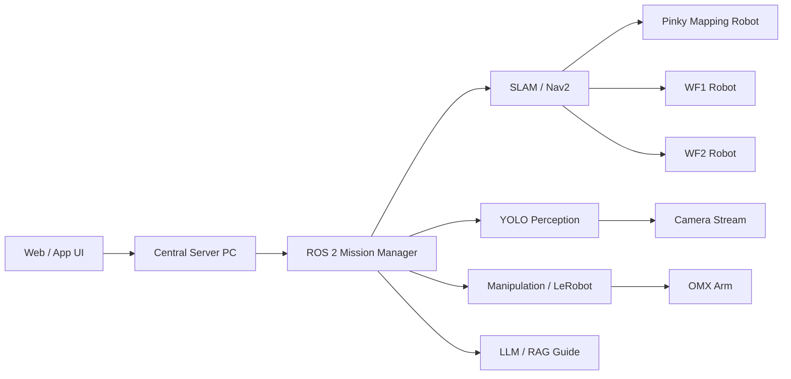

# ROScue

> **ROS 2 기반 지능형 협업 위험 객체 대응 로봇 시스템**  
> SLAM Mapping · Nav2 Navigation · YOLO Detection · Imitation Learning Manipulation · LLM/RAG Guide · Dual-Robot Manual Control

<!-- TODO: 대표 이미지 또는 데모 GIF 추가 -->
<!--  -->

---

## Overview

**ROScue**는 ROS 2 기반 다중 로봇 협업 시스템입니다.

Pinky 로봇이 SLAM 기반 지도를 생성하고, WF1/WF2 로봇은 작성된 지도를 기반으로 자율 탐색을 수행합니다. 탐색 중 YOLO로 박스를 탐지하고, 매니퓰레이터와 모방학습 policy를 이용해 박스를 개방합니다. 내부에서 등록 객체가 탐지되면 중앙 서버가 파트너 로봇을 호출하고, 운영자는 Web UI에서 두 로봇을 수동 조작하여 대응 절차를 수행합니다.

---

## Demo Flow

```text
1. Pinky SLAM Mapping
2. WF1/WF2 Autonomous Exploration
3. YOLO Box Detection
4. Box Opening by Imitation Learning
5. Internal Object Scan
6. Partner Robot Summon
7. Dual Manual Control
8. Resolve and Return to Explore
```

---

## Documentation

| Category | Description |
|---|---|
| [Folder Structure](FOLDER_STRUCTURE.md) | 레포지토리 폴더 구성 원칙 |
| [Docs Home](docs/) | 전체 문서 목차 |
| [Scenario](docs/scenario/) | 전체 미션 시나리오와 Phase 0~3 흐름 |
| [Setup](docs/setup/) | 개발 환경 설치 및 기본 설정 |
| [Runbook](docs/runbook/) | 데모 실행 순서 |
| [ROS Interfaces](docs/ros_interfaces/) | topic, service, action 정의 |
| [Architecture](docs/architecture/) | 전체 시스템, 하드웨어, ROS_DOMAIN_ID, namespace 구조 |
| [Navigation](docs/navigation/) | Pinky SLAM, 좌표 발행, Nav2 다중 로봇 주행 |
| [Perception](docs/perception/) | YOLO 박스 탐지, 내부 객체 탐지, 모델 성능 비교 |
| [Manipulation](docs/manipulation/) | 박스 개방, 모방학습, 리더-팔로워 제어 |
| [LLM/RAG](docs/llm_rag/) | 등록 객체 안내, 미등록 객체 처리, RAG 응답 구조 |
| [Embedded](docs/embedded/) | STM32 기반 버튼, LCD, LED, Buzzer 인터페이스 |
| [Web UI](docs/web/) | Web/App UI, dual YOLO dashboard |
| [Troubleshooting](docs/troubleshooting/) | namespace, domain bridge, Python 버전, cmd_vel 타입 문제 |

---

## System at a Glance



---

## Robot Roles

| Robot | Role |
|---|---|
| `Pinky` | SLAM mapping and coordinate generation |
| `WF1` | Autonomous exploration, box detection, manipulation |
| `WF2` | Partner robot, cooperative response, manipulation |
| `Central Server PC` | Mission Manager, Web UI, AI/RAG server, robot coordination |

---

## Repository Structure

```text
ROScue/
├── README.md
├── FOLDER_STRUCTURE.md
├── docs/
│   ├── README.md
│   ├── scenario/
│   ├── setup/
│   ├── runbook/
│   ├── ros_interfaces/
│   ├── architecture/
│   ├── navigation/
│   ├── perception/
│   ├── manipulation/
│   ├── llm_rag/
│   ├── embedded/
│   ├── web/
│   ├── troubleshooting/
│   └── assets/
├── ros2_ws/
├── web/
├── ai/
├── embedded/
├── maps/
├── models/
├── scripts/
└── tests/
```

---

## Quick Start

> 실제 launch 파일과 패키지명이 확정되면 업데이트합니다.

```bash
git clone https://github.com/<ORG_OR_USER>/ROScue.git
cd ROScue
```

```bash
cd ros2_ws
colcon build
source install/setup.bash
```

---

## Current Status

| Module | Status |
|---|---|
| Pinky SLAM Mapping | In Progress |
| WF1/WF2 Nav2 Control | In Progress |
| YOLO Detection | In Progress |
| Box Opening Policy | In Progress |
| LLM/RAG Guide | Planned |
| Dual Manual Web UI | In Progress |
| STM32 Interface | In Progress |

---

## Safety Notice

ROScue는 교육 및 연구 목적의 로봇 시스템입니다. 실제 위험물 제작, 해체, 무력화 절차를 제공하지 않으며, 모든 대응은 등록된 시나리오 객체와 운영자 수동 확인을 기반으로 수행됩니다.
