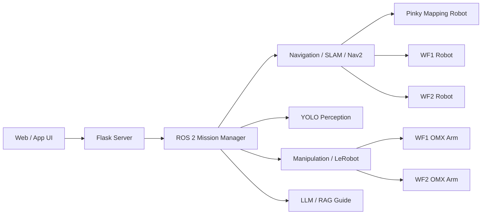
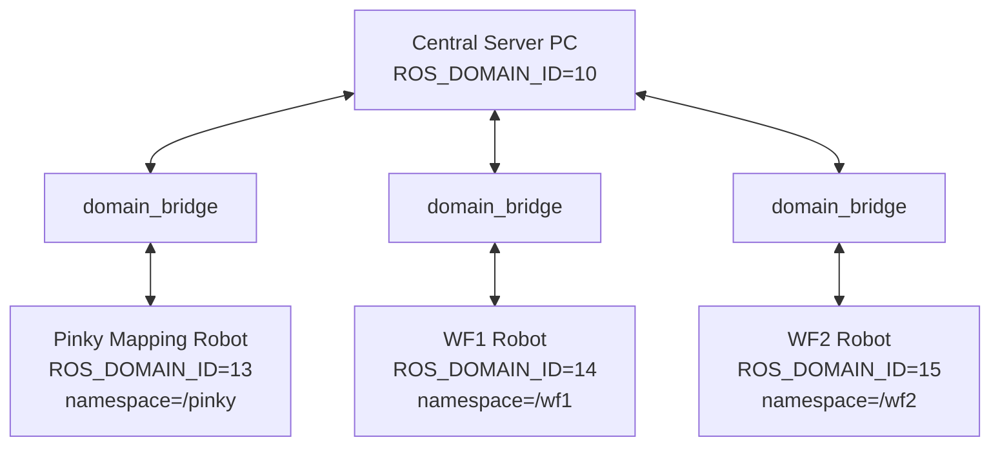

# Architecture

[← Docs Home](../)

ROScue의 전체 시스템 구조, 하드웨어 구성, ROS 2 네트워크 설계, Mission Manager 구조를 한 페이지에 정리합니다.

## On this page

- [1. System Architecture](#system-architecture)
- [2. Hardware Architecture](#hardware-architecture)
- [3. ROS Domain and Namespace](#ros-domain-and-namespace)
- [4. Mission Manager](#mission-manager)
- [5. Data Flow](#data-flow)
- [6. Open Issues](#open-issues)

<a id="system-architecture"></a>
## 1. System Architecture


> TODO: `docs/assets/system_architecture.png` 추가



<a id="hardware-architecture"></a>
## 2. Hardware Architecture


> TODO: `docs/assets/hardware_architecture.png` 추가

| Component | Role |
|---|---|
| High-Performance PC | 관제, AI 서버, LLM/RAG, 모방학습 추론 서버 |
| Raspberry Pi 4 | 상위 제어기, ROS 2 통신, 카메라/LiDAR 데이터 처리 |
| OpenCR | 하위 제어기, Dynamixel 및 주행 하드웨어 제어 |
| Camera | 상황 관찰, YOLO 입력 영상 스트림 |
| LiDAR | 공간 정보, SLAM 및 Nav2 입력 |
| OMX Arm | 박스 개방, 수동 조작, 리더-팔로워 제어 |
| Dynamixel | 주행 구동 및 엔코더 상태 피드백 |
| STM32 | 등록 객체 인터페이스, 버튼/LCD/LED/Buzzer/센서 제어 |

<a id="ros-domain-and-namespace"></a>
## 3. ROS Domain and Namespace

| System | ROS_DOMAIN_ID | Namespace | Role |
|---|---:|---|---|
| Central Server PC | 10 | `/server` | Mission Manager, DB, bridge, Web UI |
| Pinky Mapping Robot | 13 | `/pinky` | SLAM mapping |
| WF1 Robot | 14 | `/wf1` | Navigation and manipulation |
| WF2 Robot | 15 | `/wf2` | Navigation and manipulation |



### Bridge Policy

- 로봇별 독립 domain을 사용합니다.
- 중앙 서버 PC에서 domain별 bridge를 운영합니다.
- WF1/WF2의 map server는 제거하고, Pinky가 만든 `/map`을 bridge로 전달합니다.
- 중앙 서버 PC에서 robot별 topic을 구분합니다.

<a id="mission-manager"></a>
## 4. Mission Manager

Mission Manager는 ROScue의 중앙 상태 제어 모듈입니다.

주요 책임:

- FSM 상태 관리
- robot registry 관리
- box registry 관리
- explosive queue 관리
- timer 및 timeout 관리
- YOLO event 처리
- Nav2 goal dispatch
- partner robot summon
- LLM/RAG 안내 요청
- Web UI 상태 송신

### State Overview

```text
IDLE
SLAM_MAPPING
EXPLORE
APPROACH
OPEN_BOX_COVER
SCAN
WAIT_PARTNER
SUMMONED
DUAL_MANUAL
RECOVER
LOST
```

<a id="data-flow"></a>
## 5. Data Flow

```text
Camera / LiDAR / Odom
        ↓
Robot ROS 2 Nodes
        ↓
domain_bridge
        ↓
Central Server PC
        ↓
Mission Manager
        ↓
Nav2 / YOLO / Manipulation / Web UI / LLM-RAG
```

<a id="open-issues"></a>
## 6. Open Issues

- [ ] ROS_DOMAIN_ID 최종값 확정
- [ ] `/pinky`, `/wf1`, `/wf2` namespace 최종 통일
- [ ] domain_bridge topic allowlist 정리
- [ ] TF frame prefix 규칙 확정
- [ ] Mission Manager FSM 구현체 위치 확정
