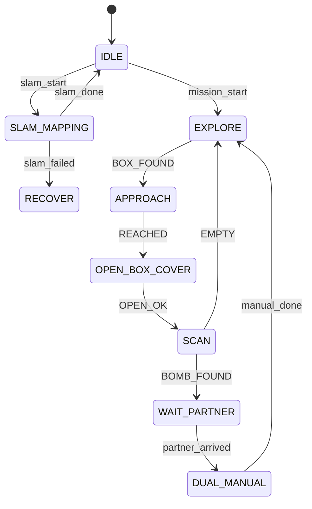

# Mission Manager

Mission Manager는 ROScue의 중앙 상태 제어 모듈입니다.

---

## Responsibilities

```text
- FSM 상태 관리
- 로봇 상태 registry 관리
- box registry 관리
- explosive queue 관리
- timer 관리
- heartbeat 감시
- Nav2 goal dispatch
- YOLO event handling
- 로봇팔/모방학습 action 요청
- LLM/RAG 안내 요청
- Web UI 상태 업데이트
```

---

## Core Data Structures

```python
robots = {
    "wf1": {"state": "EXPLORE", "pose": None, "last_heartbeat": 0.0},
    "wf2": {"state": "IDLE", "pose": None, "last_heartbeat": 0.0},
}

boxes = {
    "box_001": {
        "status": "EXPLOSIVE_PENDING",
        "pose": None,
        "detected_by": "wf1",
        "label": "Bomb_A",
    }
}

explosive_queue = ["box_001"]
```

---

## State Machine



---

## TODO

- [ ] Python FSM 구현 방식 결정
- [ ] 상태 전이표 코드와 문서 동기화
- [ ] 이벤트 타입 enum 정의
- [ ] timeout 기준값 확정
