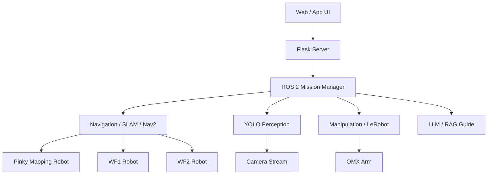

# System Architecture

ROScue의 논리 시스템 구조를 정리합니다.

---

## Layered Flow

```text
Web / App UI
    ↓
Flask Server
    ↓
ROS 2 Mission Manager
    ↓
AI Perception / Navigation / Manipulation / LLM-RAG
    ↓
Pinky / WF1 / WF2 / STM32 Scenario Objects
```

---

## Mermaid Diagram



---

## TODO

- [ ] PPT의 전체 시스템 아키텍처 이미지 추가
- [ ] 실제 노드명 반영
- [ ] data flow 화살표 정리
- [ ] server/robot 간 통신 프로토콜 확정
